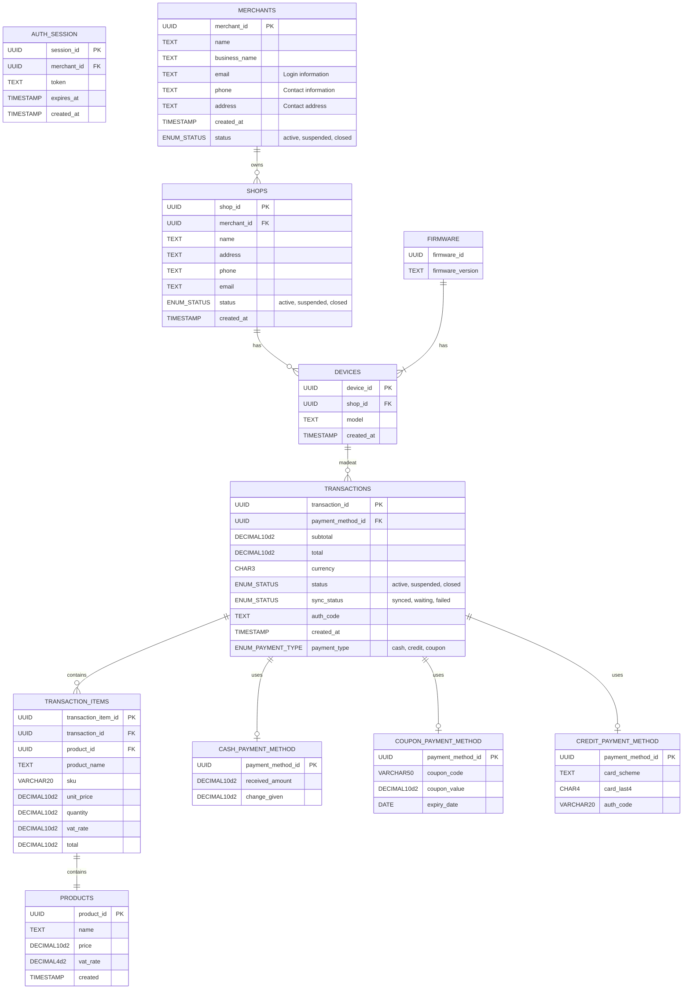

```mermaid

erDiagram
AUTH_SESSION {
UUID session_id PK
UUID merchant_id FK
TEXT token
TIMESTAMP expires_at
TIMESTAMP created_at
}
MERCHANTS {
UUID merchant_id PK
TEXT name
TEXT business_name
TEXT email "Login information"
TEXT phone "Contact information"
TEXT address "Contact address" 
TIMESTAMP created_at
ENUM_STATUS status "active, suspended, closed"
}
SHOPS {
UUID shop_id PK
UUID merchant_id FK
TEXT name
TEXT address
TEXT phone
TEXT email
ENUM_STATUS status "active, suspended, closed"
TIMESTAMP created_at
}
DEVICES {
UUID device_id PK
UUID shop_id FK
TEXT model
TIMESTAMP created_at
}
FIRMWARE {
UUID firmware_id
TEXT firmware_version
}
TRANSACTIONS {
UUID transaction_id PK
UUID payment_method_id FK
DECIMAL10d2 subtotal
DECIMAL10d2 total
CHAR3 currency 
ENUM_STATUS status "active, suspended, closed"
ENUM_STATUS sync_status "synced, waiting, failed"
TEXT auth_code
TIMESTAMP created_at
ENUM_PAYMENT_TYPE payment_type "cash, credit, coupon"
}
TRANSACTION_ITEMS {
UUID transaction_item_id PK
UUID transaction_id FK
UUID product_id FK
TEXT product_name 
VARCHAR20 sku
DECIMAL10d2 unit_price
DECIMAL10d2 quantity
DECIMAL10d2 vat_rate
DECIMAL10d2 total
}

PRODUCTS {
UUID product_id PK
TEXT name
DECIMAL10d2 price
DECIMAL4d2 vat_rate
TIMESTAMP created
}

CASH_PAYMENT_METHOD {
UUID payment_method_id PK
DECIMAL10d2 received_amount
DECIMAL10d2 change_given
}
COUPON_PAYMENT_METHOD {
UUID payment_method_id PK
VARCHAR50 coupon_code
DECIMAL10d2 coupon_value
DATE expiry_date 
}
CREDIT_PAYMENT_METHOD {
UUID payment_method_id PK
TEXT card_scheme
CHAR4 card_last4
VARCHAR20 auth_code
}

TRANSACTIONS ||--o{ TRANSACTION_ITEMS : contains
TRANSACTION_ITEMS ||--|| PRODUCTS : contains
TRANSACTIONS ||--o| CASH_PAYMENT_METHOD : uses
TRANSACTIONS ||--o| COUPON_PAYMENT_METHOD : uses
TRANSACTIONS ||--o| CREDIT_PAYMENT_METHOD : uses
MERCHANTS ||--o{ SHOPS : owns
SHOPS ||--o{ DEVICES : has
FIRMWARE ||--|{ DEVICES : has
DEVICES ||--o{ TRANSACTIONS : madeat
```
